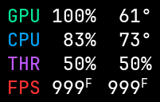

# frame-pacer

Frame-pacer is a Linux frame limiter and compact performance HUD for Steam
games. It supports Vulkan through an implicit layer and GLX/EGL through an
opt-in per-game preload shim.

> **AI-assisted development:** Frame-pacer is created and maintained by a
> professional software developer who uses AI tools extensively throughout
> development. AI may assist with research, design, implementation,
> refactoring, testing, documentation, and code review. The maintainer directs
> the work, reviews and validates changes, and remains responsible for the
> project's technical decisions and released code.



> **Initial release:** frame-pacer changes graphics presentation and can create a
> private cgroup-v2 hierarchy for an explicitly configured game. Start with one
> game, keep a rollback path, and report reproducible problems before enabling
> it broadly.

## Quick start

Frame-pacer is currently distributed as source and installed into user-local
paths from its checkout. It needs a systemd-based Linux desktop, cgroup v2 for
the optional CPU limiter, Steam, a working Vulkan loader, and the build tools
listed in [Build requirements](docs/reference/environment.md).

Build and test both 64-bit and 32-bit artifacts:

```sh
git clone https://github.com/endjynn/frame-pacer.git
cd frame-pacer
make check
make install
```

Create the configuration directory and a first rule:

```sh
mkdir -p ~/.config/frame-pacer
chmod 700 ~/.config/frame-pacer
```

Create `~/.config/frame-pacer/frame-pacer.conf` with permissions `0600`:

```ini
global_fps_limit = 70
hud = on

[Example game]
executable = "ExampleGame.exe"
fps_limit = 60
thread_cpu_limit = off
```

Replace `ExampleGame.exe` with the game's actual renderer executable basename.
`thread_cpu_limit` is optional; enable it only after normal pacing is working.
After saving the file, run `chmod 600 ~/.config/frame-pacer/frame-pacer.conf`.
When `XDG_CONFIG_HOME` is set, use
`${XDG_CONFIG_HOME}/frame-pacer/frame-pacer.conf` instead; the `~/.config`
location is the fallback.

Set the top-level `hud` option to `off` to hide the HUD while keeping frame
pacing active. Changing it back to `on` takes effect in a running game within
one second.

### Enable Vulkan games

After installation, start Steam with the layer enabled:

```sh
ENABLE_FRAME_PACER=1 \
steam
```

This enables all frame-pacer functionality provided by the installed Vulkan
implicit layer for that Steam session only. Confirm the HUD and pacing in one
Vulkan/DXVK/vkd3d-proton game.
For a permanent desktop-launcher setup, see [Steam integration](docs/steam-integration.md).

### Enable GLX/EGL games

Do **not** enable the GLX/EGL shim globally. In Steam's launch options for one
known GLX/EGL game, add:

```text
LD_PRELOAD=/absolute/path/to/frame-pacer/build/${LIB}/libframe_pacer_gl_shim.so %command%
```

Replace `/absolute/path/to/frame-pacer` with this checkout's absolute path.
Fully exit Steam before changing per-game launch options, then restart it.

## Thread CPU limiting

`thread_cpu_limit` is an optional, per-game control for a CPU-hot game thread.
Set it only inside the executable rule you want to affect:

```ini
[Example game]
executable = "ExampleGame.exe"
fps_limit = 60
thread_cpu_limit = 35%
```

Accepted values are `1%` through `100%`, or `off`. The percentage is CPU time
relative to **one logical CPU core**. At `35%`, each individual game thread
can use up to roughly 35 ms of CPU time in each 100 ms scheduling period before
it is throttled. This is useful when a game has one CPU-hot thread that drives
high boost clocks or temperatures.

The limit is not global and is not a total-game CPU cap: several active game
threads can each use their own allowance at the same time. It therefore
reduces the maximum load of any one thread, but does not guarantee a fixed CPU
package temperature or total CPU use.

Changes apply live. Edit `35%` to another valid value, or set `off` to remove
the limit and its controller without restarting the game or Steam. A missing or
invalid configuration also fails closed by disabling the limit.

When the limit is active, the purple `THR` HUD row appears:

```text
THR <peak thread use> <configured limit>
```

The limit is shown as a percentage only after frame-pacer verifies every
current game thread in its own owned cgroup with the requested ceiling;
otherwise it displays `N/A`. The first value is the real busiest-thread CPU
use over the preceding sample window. It can modestly exceed the configured
limit at a 100 ms quota-period boundary; a sustained or large excess should be
reported as a bug.

Frame-pacer creates only a private, transient cgroup-v2 subtree beneath a
user-owned scope for the selected game. It never changes Steam, a parent
cgroup, or unrelated processes. The controller removes its owned cgroups when
the game exits, crashes, or the setting is turned off. See
[CPU thread limiter](docs/cpu-thread-limiter.md) for the full design and
opt-in integration checks.

## Inspired by MangoHud

Frame-pacer is directly inspired by [MangoHud](https://github.com/flightlessmango/MangoHud).
Thank you to the MangoHud maintainers and contributors for their excellent,
long-running work on Linux gaming tooling.

The two projects have deliberately different priorities:

| Project | Primary focus | HUD role |
| --- | --- | --- |
| MangoHud | A highly configurable performance and monitoring HUD; FPS limiting is one of its capabilities. | Rich and configurable. |
| frame-pacer | Predictable FPS pacing and opt-in per-thread CPU limiting. | Minimal, automatically scaled, and secondary to pacing. |

Frame-pacer is complementary to MangoHud, not a replacement for it.

## Features

- Vulkan, DXVK, and vkd3d-proton frame pacing and HUD through an implicit
  layer.
- GLX/EGL pacing and HUD through an opt-in per-game preload shim.
- Live, per-executable FPS rules.
- Optional live per-thread CPU ceilings using a private transient cgroup-v2
  controller.
- GPU, CPU, FPS, and thread-CPU HUD telemetry that degrades safely to `N/A`,
  with resolution-aware scaling and a transient embedded x86_64 NVML helper
  for i386 NVIDIA games.

## Documentation

- [Installation](docs/installation.md) — requirements, safe activation, and
  rollback.
- [FPS limiter](docs/fps-limiter.md) — configuration, matching, and reload
  behavior.
- [CPU thread limiter](docs/cpu-thread-limiter.md) — controller behavior,
  cleanup, and verification.
- [HUD](docs/hud.md) — metric meanings and `N/A` behavior.
- [Steam integration](docs/steam-integration.md) — Vulkan and GLX/EGL
  activation boundaries.
- [Contributing](CONTRIBUTING.md) — development and test expectations.
- [Security policy](SECURITY.md) — reporting guidance.

## Support scope

The supported deployment is a source build on a systemd-based Linux desktop
with cgroup v2, Steam, and a Vulkan loader. x86_64 and i386 artifacts are
built together. Flatpak/Flathub packaging and non-Steam launchers are not
currently supported.
